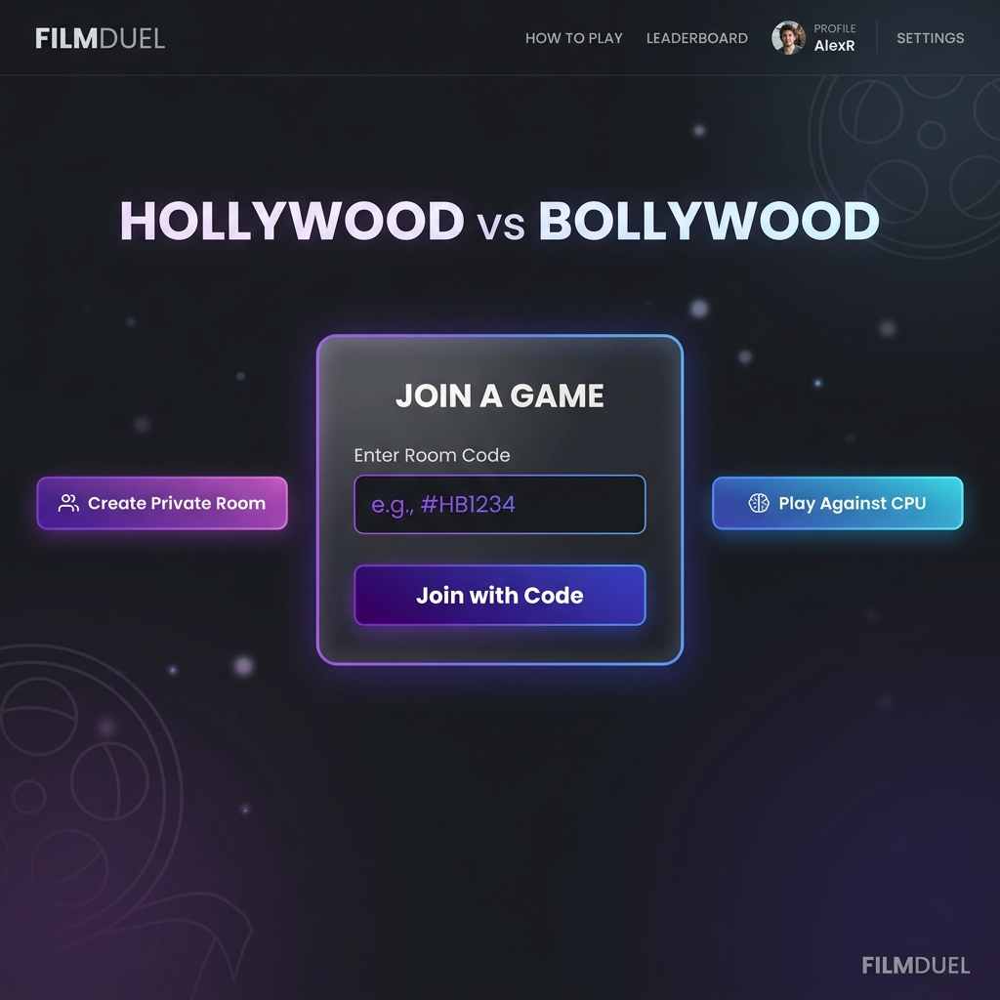
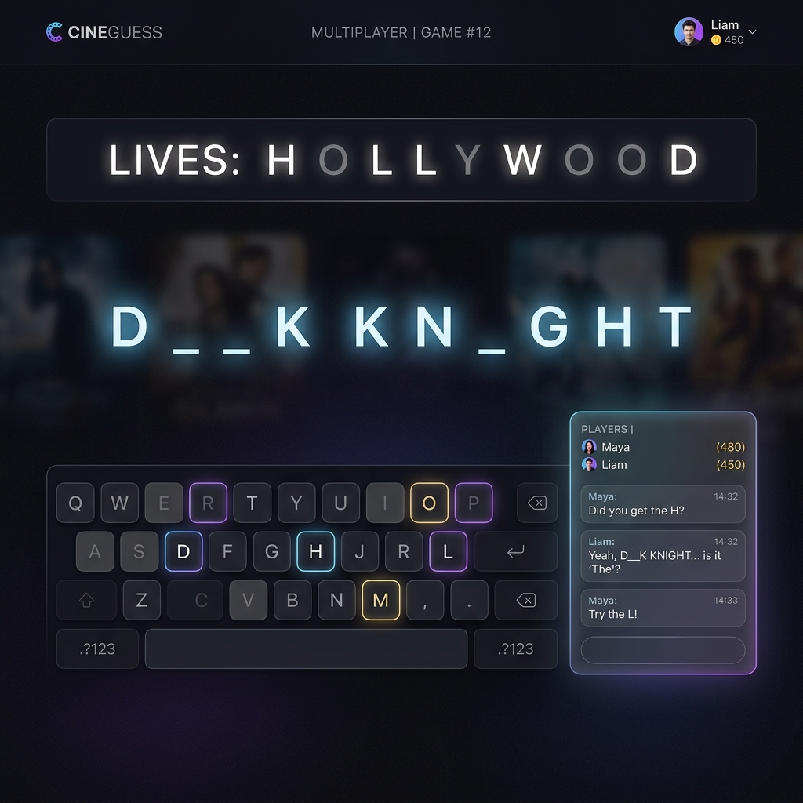

# 🎬 Hollywood / Bollywood — Movie Guessing Game

Multiplayer movie guessing game built with React, Node.js, Express, and Socket.io using in-memory state management.

## 📸 Screenshots

| Home & Room Selection | Active Gameplay & Chat |
|:---:|:---:|
|  |  |

## How to Play

- **Picker** types a movie title or generates a random one from our built-in databases.
- **Guesser** reveals letters one at a time using the interactive A–Z keyboard.
- **9 chances** — one per letter in the word **H·O·L·L·Y·W·O·O·D**.
- **1 hint** per game — picker can provide one hint, and guesser can request it at any time.
- **Full guess** — guesser can attempt to guess the full movie title at any time.
- **Scoreboard** — points are awarded to the guesser based on how few attempts they took to guess the movie, and players alternate roles.
- **Real-Time Chat** — both players can chat with each other throughout the game!
- **Play Against CPU** — single-player mode where you play against a smart computer picker.

---

## 🚀 Quick Start (Local)

### 1. Install dependencies

```bash
npm install             # root (installs concurrently)
npm run install:all     # installs server + client deps
```

### 2. Set up environment

```bash
# Copy env templates if needed
cp server/.env.example server/.env
cp client/.env.example client/.env
```

### 3. Run both server + client

```bash
npm run dev
```

- Server → http://localhost:5000
- Client → http://localhost:5173

---

## 📁 Project Structure

```
├── server/                  # Node.js + Express + Socket.io
│   ├── index.js             # Entry point
│   ├── models/Room.js       # In-memory Room model & game state
│   ├── socket/gameHandler.js # All game socket events & chat
│   ├── data/
│   │   ├── hollywood.js     # Hollywood movie database
│   │   └── bollywood.js     # Bollywood movie database
│   └── utils/computer.js    # CPU guessing strategy & hint generator
│
├── client/                  # React 18 + Vite
│   ├── vercel.json          # SPA routing config
│   └── src/
│       ├── context/GameContext.jsx  # Global state & socket listeners
│       ├── pages/
│       │   ├── Home.jsx     # Landing page (Create/Join/CPU)
│       │   ├── Lobby.jsx    # Waiting room & Room key sharing
│       │   └── Game.jsx     # Main game screen
│       └── components/
│           ├── MovieDisplay.jsx  # Blanks and word reveal
│           ├── Keyboard.jsx      # Interactive letter grid
│           ├── LivesDisplay.jsx  # HOLLYWOOD lives indicator
│           ├── Chat.jsx          # Live chat interface
│           ├── Scoreboard.jsx    # Point system & alternate rounds
│           └── HintBox.jsx       # Hint request & display banner
│
└── package.json             # Root: scripts to run concurrently
```

---

## 🛠 Tech Stack

| Layer     | Tech                             |
|-----------|----------------------------------|
| Frontend  | React 18, Vite, React Router 6   |
| Backend   | Node.js, Express 4               |
| Real-time | Socket.io 4                      |
| Database  | In-memory state (No database overhead) |
